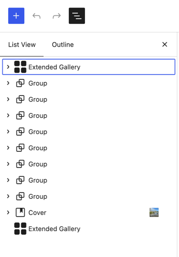
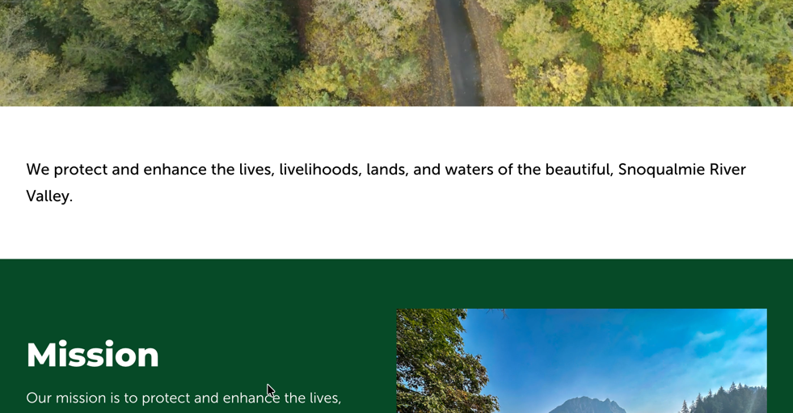
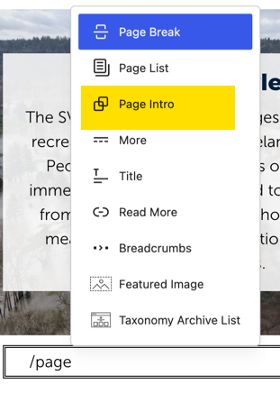
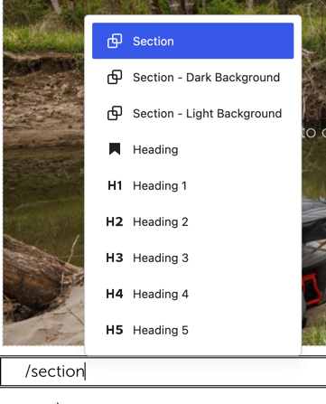
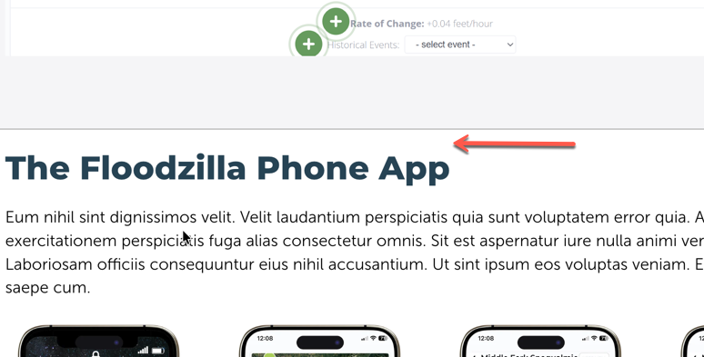
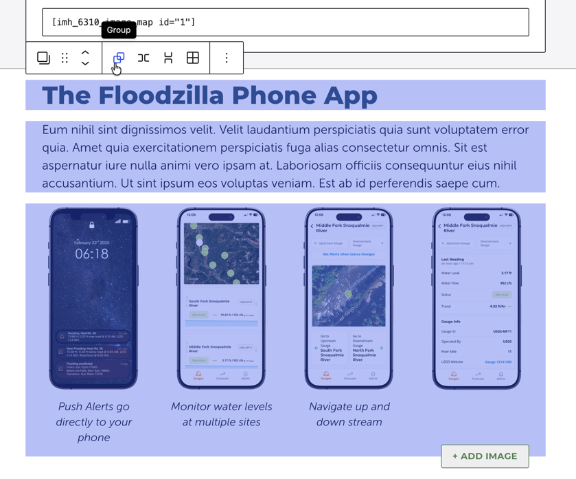
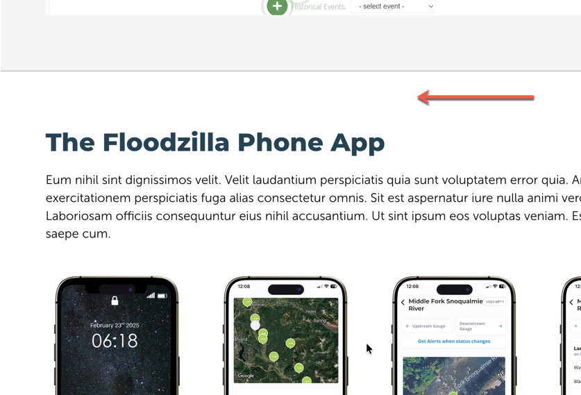
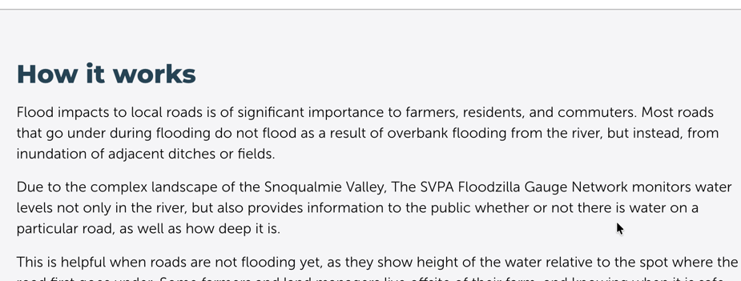
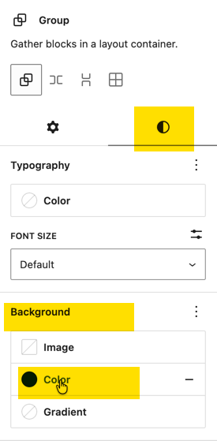
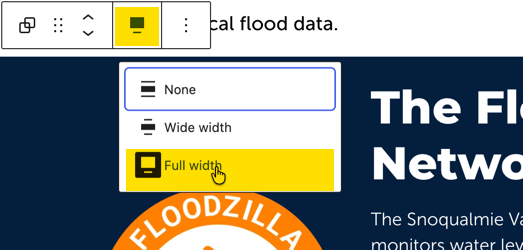

On Content pages, we usually group the page into sections to create more visually interesting layouts. Each section of the page should be wrapped in a group block to get the spacing correct. Think of each outer group as the section. 

|                                                              |                                                              |
| ------------------------------------------------------------ | ------------------------------------------------------------ |
|  | Looking at the list view of a page, there are groups down the page. |
|  | On most pages the first block should be the Page Intro. This is a preconfigured group block that sets the correct spacing an font size. |
|  |                                                              |
|  | As you build the page, search for section. This will give you some preconfigured groups to add to the page. |
|  | If you add a heading or paragraph directly on the page, the correct spacing will not be applied |
|  | If the elements are already on the page, select the items to group. When you hover over the elements, the toolbar will give you the option to group. |
|  | Grouping gives the proper amount of space.                   |

## Background Colors

Add a highlight to your page with groups with a background color.

|                                                              |                                                              |
| ------------------------------------------------------------ | ------------------------------------------------------------ |
|  | Choose Section - Dark Background or Section - Light Background to get the preconfigured group. |
|  | Light background has a light gray background with borders.   |
|  | Dark background has a blue background, this could be switched to Green.   When putting a dark background on a group, the text inside should automatically display in the contrasting color. |
|  | You can change the background color in the block style settings tab |
|  | If you want to convert an existing group to use a background, be sure to set the width to **Full** |

