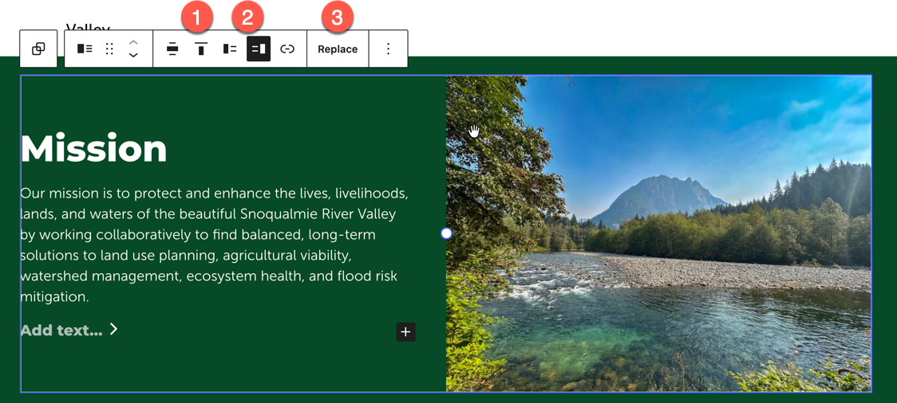
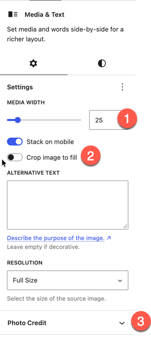
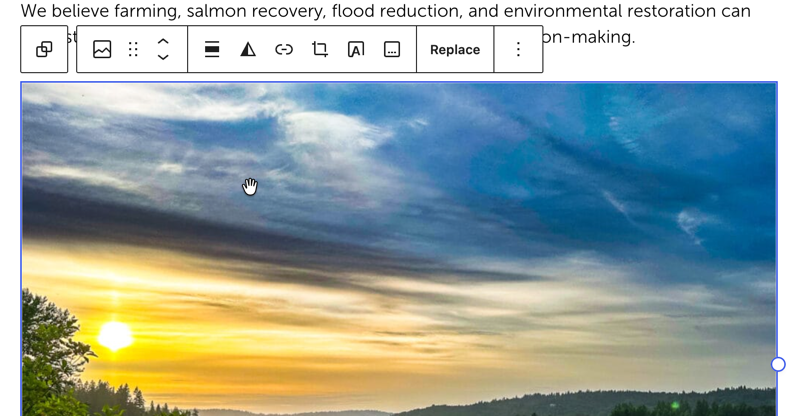
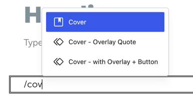
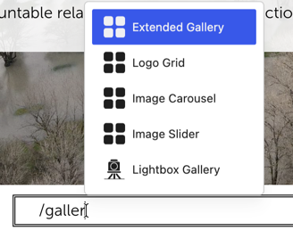
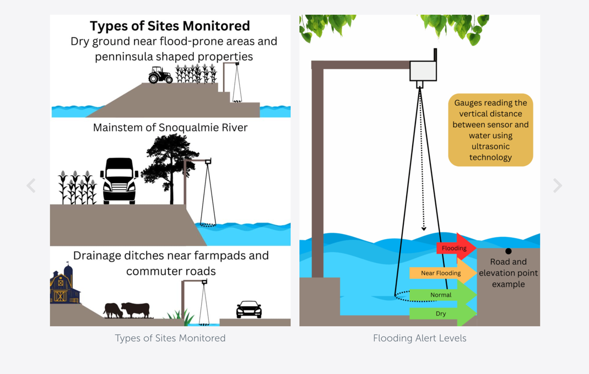

There a multiple ways to place an image on the page. The block choice will depend on the layout desired.

* [Media Text](#media-text-block) - image and text side by side
* [Image Block](#image-block) - standard full image (normal, wide or right/left aligned)
* [Cover Block](#cover-block) - full width, with overlayed additional content (image or text)
* [Extended Gallery](#extended-gallery-block) - to show a collection of images in a grid, carousel or slider

## Media Text Block
The Media Text block places an image and text side by side. In mobile views the image is displayed on top. This same layout could be achieved with the Columns Block and Images or an Image Block aligned right or left. The Media Text block is preferred as it will provide more consistent results.

**From the Toolbar**

1. Align content top or middle

1. Flip which side the image is on

1. Replace the image with a new one

---

**From the Block Settings Pane**

1. Adjust the width of the image - should be 50% unless displaying a logo
2. Crop Image to Fill will set the image to a consistent size. Recommended to toggle this **on** unless displaying a logo or portrait layout image.
3. Optionally display the Photo Credit (or Caption) - [see below](#image-captions--photo-credits)

## Image Block
Use the Image block when you simply want to place an image on the page. On pages, images are best at a normal or wide width. On news posts you can right or left align the image if desired.

Right/Left aligned images allow the text to flow around the image. This works well on blog posts where there is a lot of text. On pages that are broken up into sections, this can cause layout issues, so use a Media Text block instead.

## Cover Block
The Cover Block allows you to add content as an overlay on top of the image. We have a couple of pre-built patterns for using the cover block consistently.

### Cover - Overlay Quote (Pattern)

Places the cover block with an overlay with a quote block.

### Cover - with Overlay + Button (Pattern)

Places the cover block with an overlay with text and a button

## Extended Gallery Block

The extended gallery can be used in a wide variety of instances to show

* Logo Grid
* Image Carousel (Multiple Images)
* Image Slider (1 image at a time)

Search the Block Add menu to get a block that is pre-configured for the use case.

| Logo Grid                                                    | Image Carousel                                               | Slider                                                       |
| ------------------------------------------------------------ | ------------------------------------------------------------ | ------------------------------------------------------------ |
|  |  |  |

## Image Captions & Photo Credits

See [Photo Credits](photo-credits.md)

