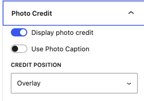
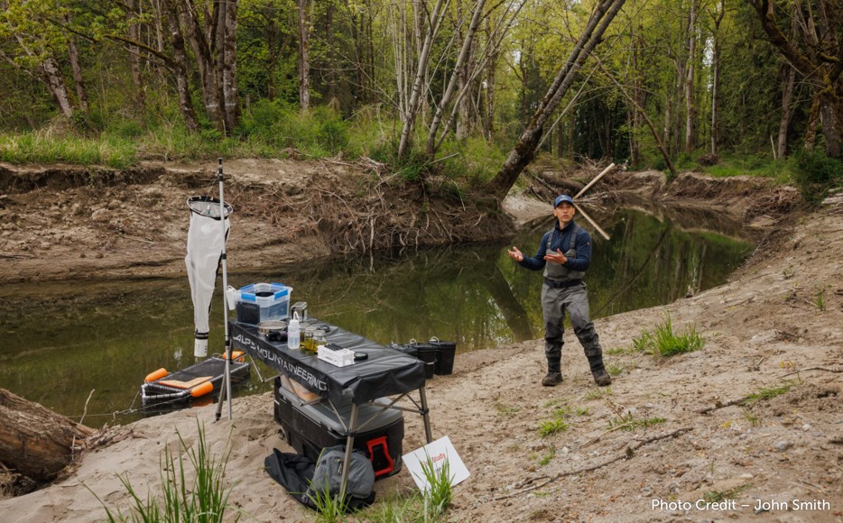
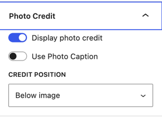

Within the Media Library you can add Image Captions and Photo Credits to any image that can be displayed around the site. You may need to activate these elements for them to display. Not every image block displays the photo credit and not every one works in the same way.

We cannot show the image caption and the photo credit at the same time, so if you want to show both, add the credit to the caption.

## Page Headers
If a photo credit is provided, it will display automatically on the page header (featured image).

Captions are not displayed on Page Headers.

## Cover Block
You can optionally display the photo credit on a Cover Block within the Block Settings Pane.

**Recommended**: Position the Photo Credit as an overlay on the Cover Block

Photo Captions are not typically used on a Cover Block, use an image block instead.

|                                                              |                                                              |
| ------------------------------------------------------------ | ------------------------------------------------------------ |
|  |  |

## Media Text Block

With the Media Text Block, you can display either the caption or the credit, using the Photo Credit functionality.

Note that the Photo Credit Functionality does not display in the editor view.

|                                                              |                                                              |
| ------------------------------------------------------------ | ------------------------------------------------------------ |
|  |  Works best with a cropped image in the the view |
|  |  |

