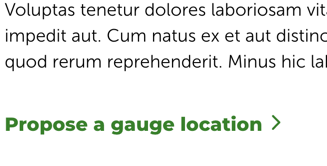
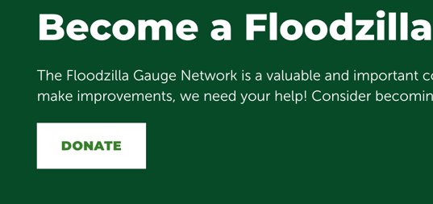
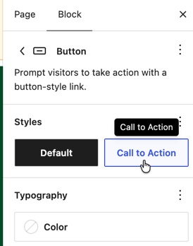

The button block is used for two different styles. Button and Call to Action

|                                                              |                                                              |
| ------------------------------------------------------------ | ------------------------------------------------------------ |
|  | The link with the arrow is a button with the Call to Action style applied.   Add it to the page by searching Call to Action. |
|  | The default button is a little more bold. These should be used sparingly on a page. |
|  | Convert a button to a Call to Action by changing the style in the block settings pane. |
|                                                              |                                                              |

