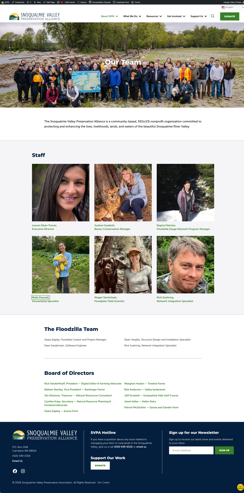

## Custom Post Type Archive

The Custom Post Type Archive block is used around the site to display a list of posts of any type on a page. There are a number of settings to configure the layout in all manner of ways. 
In most cases these will be on the site already. If you need help displaying content this way, feel free to reach out to your developer. 

|                                                              |                                                              |
| ------------------------------------------------------------ | ------------------------------------------------------------ |
|  | The our team page uses several instances of the archive block to display the teams in different ways. |
|                                                              |                                                              |
|                                                              |                                                              |
|                                                              |                                                              |

