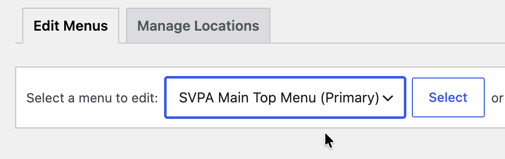

The site header and footer can be modified within the site admin to some degree, consult your developer if would like to add or remove items. 

## Site Header

The site header is specifically designed to work with your site parameters. If you want to make significant changes to the header, work with your developer. 

You can add or remove pages to the main menu. Do not add any additional top-level items. Sub-menus should generally stick to 5-7 items max.

To edit the menu go to: 

* **WP-Admin** > **Appearance** > **Menus**. 

Select the Primary menu to edit it. 

## Site Footer

To edit the site footer go to

**WP Admin** > **Appearance** > **Template Parts**

Select **Site Footer** from the grid.

Make text updates as you need to. Significant changes should go through your developer.

